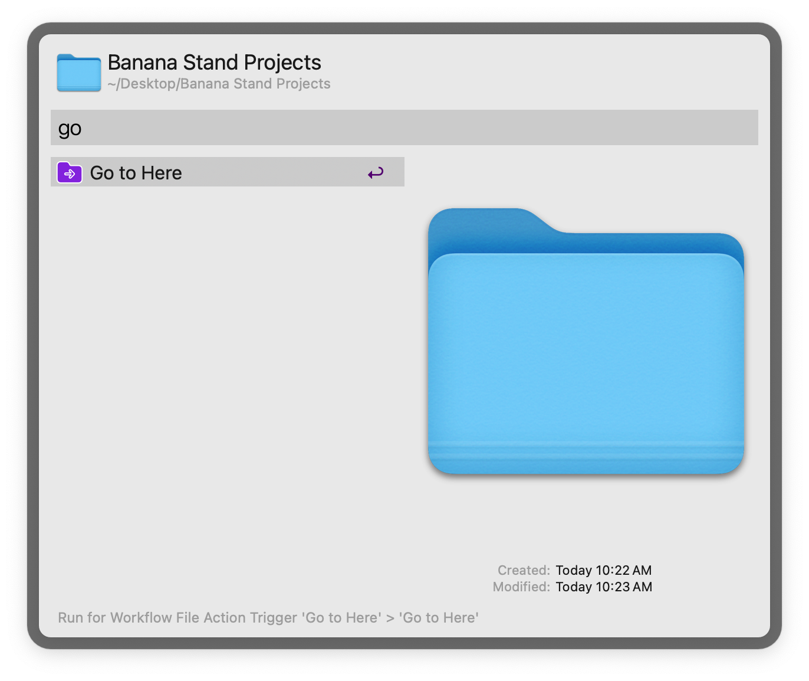
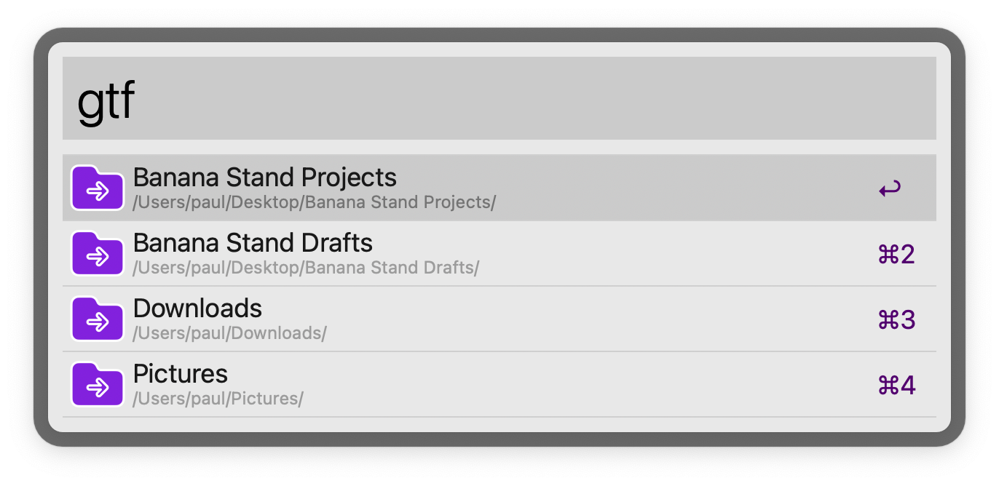
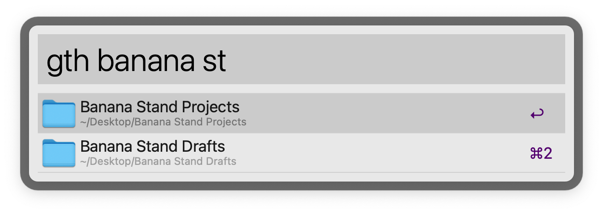

# Go To Here - Alfred workflow

Switch current path of Open/Save dialogs and Finder windows

## Note on updating to version 4+

*(If you've updated via the Alfred Gallery, you can ignore this message).*

The bundleID has changed since version 3.x. Importing later versions than 3.x will create a new Alfred workflow instead of updating the previous one.

Once you've imported the new version, delete the old version (check the version number beginning with `v` at the top of the main window). This also means that any changes you've made to the workflow's configuration will need to be redone.
___

[Available on the Alfred Gallery](https://alfred.app/workflows/paulrudy/go-to-here/)

[Alfred forum thread](https://www.alfredforum.com/topic/21963-go-to-here-updated-version/)

For the original workflow on which this one was based, see this [older Alfred forum thread](https://www.alfredforum.com/topic/6013-go-to-here).

## Usage

Switch the selected path in a MacOS Open/Save (and similar) dialog via the [Universal Action](https://www.alfredapp.com/help/features/universal-actions/). 

This can also be used to navigate the currently focused Finder window to the chosen path.

Alternatively, get paths for open Finder windows and tabs via the keyword `gtf`, or search files and folders via the keyword `gth`.

The workflow recognizes dialog windows based on the action button name. Button names recognized by default: "Open", "Save", "Export", "Move", "Select", "Upload", "Choose", and "Choose file". Those button names can be edited to add others, and/or to replace them with non-English versions, in the [Workflow Configuration](https://www.alfredapp.com/help/workflows/user-configuration/), along with adjusting the speed of execution in case of slower machines.

In the Finder, the workflow will switch the currently focused tab/window to the chosen path. If no window is open, it will open a new one.

### Call workflow from another workflow

Optionally use the external trigger to call this workflow from another one. For example:

1. In a separate workflow, add a List Filter, File Filter, or Script Filter. The workflow needs to output a file or folder path.
2. Add a [Call External Trigger Output](https://www.alfredapp.com/help/workflows/outputs/call-external-trigger/) for outputting the path.
3. In the settings for that output, click "Workflow Triggers..." and choose the trigger for this workflow.

## Credits

Thanks for help and suggestions: [ahmadt](https://www.alfredforum.com/profile/9334-ahmadt/), [sepulchra](https://www.alfredforum.com/profile/717-sepulchra/), [vitor](https://www.alfredforum.com/profile/1891-vitor/), [jwrc](https://www.alfredforum.com/profile/55950-jwrc/), [tombenz](https://www.alfredforum.com/profile/32208-tombenz/), [gingerbeardman](https://www.alfredforum.com/profile/1410-gingerbeardman/)

Icon credit: [Stash Icons](https://github.com/stash-ui/icons). [MIT License](https://github.com/stash-ui/icons/blob/master/LICENSE)
