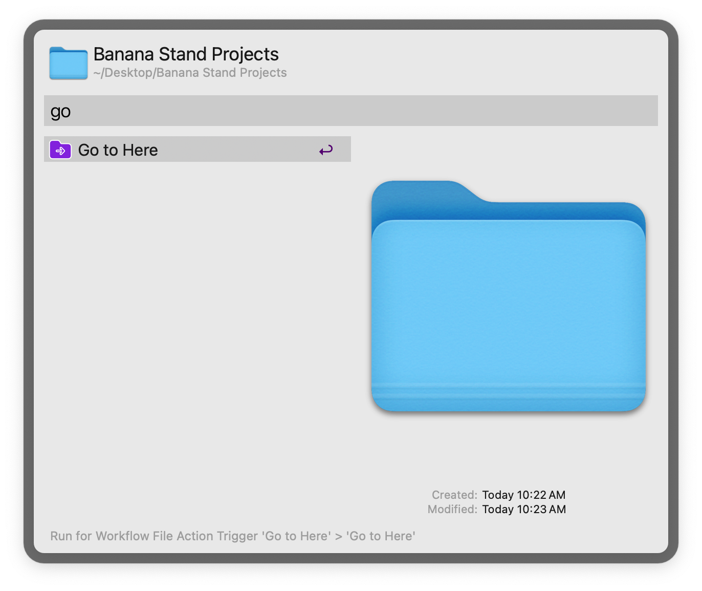
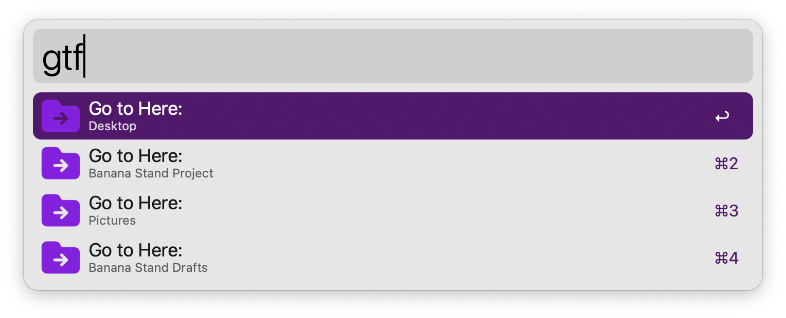
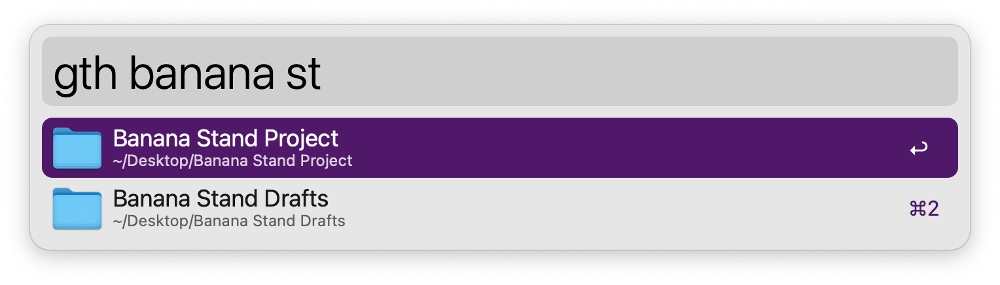

# Go To Here - Alfred workflow

[Available on the Alfred Gallery](https://alfred.app/workflows/paulrudy/go-to-here/)

[Alfred forum thread](https://www.alfredforum.com/topic/21963-go-to-here-updated-version/)

For the original workflow on which this one was based, see this [older Alfred forum thread](https://www.alfredforum.com/topic/6013-go-to-here).

## Usage

Quickly switch the selected path in a MacOS Open/Save/Export/Move dialog based on an Alfred selection.

With an Open/Save/Export/Move dialog active, invoke the workflow with one of these methods for selecting a file or folder path:

Search for a file or folder and apply to the dialog via the [Universal Action](https://www.alfredapp.com/help/features/universal-actions/).

Alternatively, get paths for open Finder windows and tabs with keyword `gtf`, or select a file or folder in Alfred with keyword `gth`. `↩` to apply to the dialog.

Advanced users can also use the External Trigger from another workflow (not shown, see below).

The workflow looks for English-language button titles in the dialog. Non-English users can change these strings in the [Workflow Configuration](https://www.alfredapp.com/help/workflows/user-configuration/), along with adjusting the speed of execution in case of slower machines.

### Call workflow from another workflow

Optionally use the external trigger to call this workflow from another one. For example:

1. In a separate workflow, add a List Filter, File Filter, or Script Filter. The workflow needs to output a file or folder path.
2. Add a [Call External Trigger Output](https://www.alfredapp.com/help/workflows/outputs/call-external-trigger/) for outputting the path.
3. In the settings for that output, click "Workflow Triggers..." and choose the trigger for this workflow.

## Credits

Thanks for help and suggestions: [ahmadt](https://www.alfredforum.com/profile/9334-ahmadt/), [sepulchra](https://www.alfredforum.com/profile/717-sepulchra/), [vitor](https://www.alfredforum.com/profile/1891-vitor/), [jwrc](https://www.alfredforum.com/profile/55950-jwrc/), [tombenz](https://www.alfredforum.com/profile/32208-tombenz/)

Icon credit: [Stash Icons](https://github.com/stash-ui/icons). [MIT License](https://github.com/stash-ui/icons/blob/master/LICENSE)
